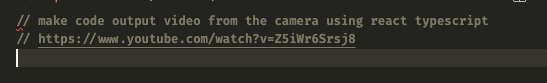
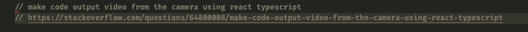

# ChatGPT vs Copilot-1

## Question
`make code. output video from the camera using react typescript`

## 작업 과정
    ### ChatGPT
    1. https://chat.openai.com/chat 사이트 접근
    2. 입력란에 질문(`make code. output video from the camera using react typescript`) 기재.
   
    ### Copilot
    1. *.tsx(CopilotCameraVideoComponent.tsx) 파일에 주석란으로 질문 기재
    (`make code. output video from the camera using react typescript`)

-----

## 결과(스크린샷 / 소스코드 첨부)

### chatGPT

### copilot

-----

## 개인 의견
사용자가 원하는 결론 도출 및 사용성 측면, 그리고 작업 소요시간 면 ChatGPT를 이용해서 작업하는게 편했습니다.
원하는 결과물이 정확하진 않더라도, 작업 서비스의 맥락 및 추론 능력 그리고 안내형식의 description 가이드로 Human이 이해할 수 있도록 설명을 제공하였습니다. 하지만 잘못된 결과전달, 오류를 정답으로 결론지어 사용자에게 전달하는 문제가 몇몇 보여, 작업자에게 오해의 소지를 만들게 됩니다.

Copilot에서 제공하는 검색엔진으로는 추상적인 질문으로 원하는 결과물을 도출하기는 힘들었으며,
1차 질문`(make code. output video from the camera using react typescript)`의 결과값이 정상적이지 않아, 작업자가 어느정도의 코드 작성 및 자세한 질문으로 결론을 천천히 도출하는 느낌이 들었습니다.
하지만 Copilot을 적용하면서 VSCode 에디터에서 다루는 Code Intellisense 기능이 향상되었다는 느낌이 들어. 사용자의 작업 환경 및 코드 문맥을 실시간으로 분석하여 자동으로 코드 블럭과 힌트를 만들어주는 아름다움을 보여주었습니다. Copliot 기능을 통해 작업자는 자연스럽게 코드를 타이핑하면서 보다 빠르게 작업을 완료할 수 있었지만, 코드 작성 과정 중 원치않는 문맥 및 잘못된 가이드로 issue, bug check가 우려되었습니다.